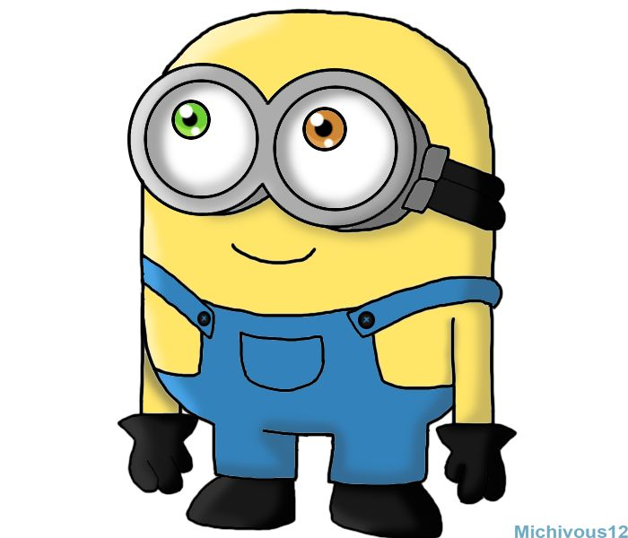

# Neural-Style-transfer
This project is based on Neural style transfer, where we have to generate image such that it has content of content image and style of style image.  includes code for NST written in keras. 
Separate loss function according to the formulae given in  (for content loss and style loss) are made in keras. **fmin_l_bfgs_b optimizer** from scipy library is used to minimize net loss function and generate image. Generated image contains the content of content image in style of style image.

## Content Image

## Style Image

